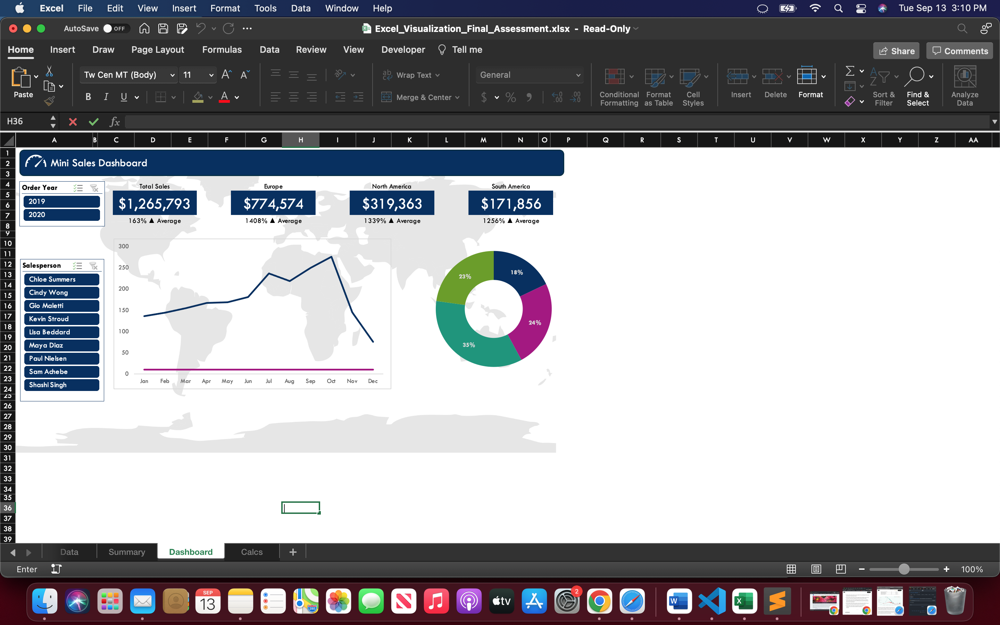

# MS_Excel

## Part 1 - Excel Fundamentals for Data Science 

### Final Assessment

**Purpose** :

You have been asked by a school to help automate their accounts processing.

**Context** :

Every few days they receive a text file from the bank detailing payments received (BPAY sheet). This information must be matched to the system data that has been downloaded into Excel (SYS DATA sheet) and a report produced that will be uploaded to the school system.

**Analysis** :
1. Go to the Upload sheet (this is where all calculations are to be done). You will see that the BpayReference has already been populated. The next column needs to contain the TransactionReference, which is made up of the MERCHANT, followed by the SETTLEMENT DATE, followed by the MERCHANT REFERENCE from the BPAY Bank File sheet, with no space between them, e.g. ANB20201002120026834. Create a calculation in B2 that will join these values together and then copy the formula down. What is the value of Check Digit 1 in cell T13?

2. Using Excel 2019, the problem in question 1 could have been solved using which of the following: (Multiple answers may apply.)

3. The Customer Reference number is how we identify customers in our system. The BPAY reference appears to consist of the 9 digit School identifier, followed by the 5 digit Customer Reference. In column C create a calculation to extract the last 5 characters from the BPAY Reference and convert it to a numeric value. (You will notice that we don’t get 5 numbers – we will fix that in the next question). What is the value of Check Digit 2 in T14?

4. We didn’t quite get the results we wanted in the last question and on closer inspection we discover that there is a space at the end of the BPAY reference. Modify the calculation in column A to remove the extra spaces. The Customer References should now be corrected. What is the updated value for Check Digit 2 in T14?

5. Which of the following functions (on their own) could you have used to achieve the outcome in Question 4?

6. In the BPAY file dates come through in the format YYYYMMDD, which makes them difficult to perform calculations with. In column D create a calculation to extract the two digit month from the corresponding paiddate in the BPAY sheet. (Do not convert to a number). What is the value of Check Digit 3 in T15?

7. In column E use a calculation to convert the paid date in the BPAY sheet to a valid Excel date. Formats will differ for different regions, but once converted you should be able to switch between number format and short date format. (Hint: you will need to separate and rejoin the separate parts of the date using an appropriate date function. What is the value of Check Digit 4 in T16?

8. In column F we need to get the payment amount from the BPAY sheet, but you will notice it is being treated as text because of the "AU" at the front. Apply functions to remove the unwanted characters and convert to a number. Which of the following combinations of calculations could you use?

9. The calculation in Column G has been done, it calculates the outstanding balance for each payee by adding up the fee, arrears, and other charges from the SYS DATA sheet. Quite a lot of them are showing 0 though. The reason is the calculation is using named ranges that do not include all the data on the SYSDATA sheet. Change the Named Ranges Amount and Cust_Ref to include all the data in those columns. The balances should now be correct. What is the total balance in T7?

10. You would also like to see a breakdown of total outstanding fees and arrears. Start by naming the other columns in the SYS DATA sheet. Back in the Upload sheet create a calculation in T10 to calculate the total Amount (in SYS DATA) where the type is fee_amt. Copy the formula down to get the total arrears_amt. What is the Total Arrears amount as shown in T11?

11. You realise you could make your life a little easier and your solution more robust by working in a table. Convert the data in A1:Q69 to a table. Turn on the Total row and add a SUM total in the Balance column. Filter the table to only show payments made in October. What is the Total Balance?

12. Clear the filter you added in Question 11. In column H use the Customer Reference to look up the invoice date for that customer from the data in the SYS DATA sheet. (All transactions for one customer will have the same date.) What is the value of Check Digit 5 in T17?

13. In column I, use the data in columns E and H to calculate how many days there were between when the invoice was issued and when it was paid. How many days did it take Customer 82555 to pay?

14. The due date for invoices is 21 working days after invoices are issued. This has already been calculated in column J. In column K we would like to identify those people who paid early. Create a calculation in column K that returns a Y if they paid before the due date and otherwise leaves the cell blank. What is the value of Check Digit 6 in T18?

15. In column L calculate how many working days (excluding Saturdays and Sundays, but not holidays) those who paid early, paid by. If they did not pay early the calculation should just return 0. In the total row add a sum for this column. What is the total shown in the total row?

16. Customers who pay 5 working days before the due date are eligible for a discount. In column M calculate the date 5 working days before the due date (excludes Saturdays and Sundays). In the total row add an average to Discount Due Date. What was the average (formatted as a date)?

17. Discounts are calculated as a percentage of the balance owed, rates vary depending on how large the balance is. The lookup table in S2:T5 details what percentage is applied, so for example balances from 300 to 11999.99 get a 5% discount. In column N calculate how much discount will be awarded for each customer if they are eligible. Include an Average calculation in the Total row for Discount Offered. What was the average Discount Offered?

18. To be eligible for discount customers must have paid before the Discount Due Date and must have paid at least the full balance owing less the discount amount, i.e. if the Balance was $300 then the discount would be $15, so if they paid early and paid $285 or more they get the discount. In Column O enter a calculation that will return the Discount Offered amount for customers who are eligible and 0 for those who are not. Add an Average calculation to the Total row. What is the average discount being awarded?

19. Where there is more than one student enrolled, customers are given a 5% sibling discount. This is applied to the fees up front but as part of the report you are required to calculate what this amount was. The calculation has already been done in column P, but it has been calculated for everyone. Change the calculation so it looks up the enrolments for the customer in the SYS DATA sheet and only calculates the Sibling Discount if the number of enrolments is two or more. (If no siblings return 0.) Include an Average for Sibling Discount in the Total row. What is the average sibling discount?

20. A valid solution for Question 19 could be achieved using which of the following combinations of functions? (Multiple answers may be correct.)

**Solution** :
<a href="https://github.com/ochoa-jessica/MS_Excel/blob/main/Excel_Fundamentals_Data_Science/Final_Assessment_Excel_Fundamentals_Data_Science.xlsx">Excel Fundamentals for Data Science Final Assessment Solution</a></li>

## Part 2 - Excel Data Visualization 

### Final Assessment

**Purpose & Context** :

You have been asked by a xyz business company to generate summary sales data dashboard by sales person and for month 2019.

**Analysis** :
1. Add a conditional format to the data in C5:N13 to show the top 5%. Which salespeople achieved a monthly sales total in the top 5%?

2. Select the data in A5:O13 and add a Conditional format rule that will highlight the whole row (in any colour you choose) where the salesperson's name matches the selection in B15. 

3. Apply custom number formatting to the data in P5:P13 so that if the number is >0 it shows as a white star and otherwise leaves the cell blank. 

4. In Q5 insert a Column Sparkline to visualise the data in C5:N5. Copy the sparkline down to Q13. 

5. Have a look at the chart titled Sales May-Oct 2019.

6. The chart titled Sales May-Oct 2019 is showing the monthly sales for two salespeople, but it is difficult to see which ones. Turn on the legend (show at bottom). Which two salespeople are represented in this chart?

7. The chart titled Sales May-Oct 2019 is missing the Horizontal Axis Labels. How can we fix this?

8. In the chart Sales May-Oct 2019 select the line series and add a trendline to it. Show the R-Squared value and try out some of the different trendline options. Which one returns the highest R-Squared value?

9. A series has been added to Sales by Region but it is not currently picking up the correct values. Update the series to use the relevant data in A38:D58.

10. The chart Sales by Region is still not quite right because the horizontal axis is not aligning correctly to the map. The values need to be changed to Min -180 and Max 180. 

11. Go to the Data sheet which contains all the orders received for 2019 and 2020. You need to find out the total value of orders placed for each month in 2019. Insert a PivotTable called pvtSalesByMonth in a new sheet. Add Order Month to Rows, Extended Price to Values, and Order Year to Columns. What was the Total value of orders for March 2019?

12. Change pvtSalesByMonth to show the number of orders by year and month. How many orders were placed in June 2020?

13. Make the following changes pvtSalesByMonth:
Move Order Year to the Filter section and filter to show data for 2019
Move Salesperson to the Filter section and filter to show data for Kevin Stroud.
What was the number of orders secured by Kevin in June 2019?

14. Create a Line PivotChart to represent the data in pvtSalesByMonth. Change the title to Orders by Month. 

15. Each salesperson has a target of 10 orders per month. We would like to show how their monthly order totals compare to their target in the chart we just created. To do this we will need to add another column to our pivot table that contains the value 10 for each month. How do we do this?

16. Copy and Paste the chart into the Dashboard sheet. Move it so it sits over South America and Africa and then turn off the title and set the Fill and Border to Nothing.

17. Create a new PivotTable in a new sheet called pvtSalesByQuarter to show the total sales (extended price) by Quarter. Add Order Year and Salesperson to the Filter area and filter the Pivot to only show Kevin Stroud's sales for 2019. What were his total sales for Quarter 3?

18. Create a Donut PivotChart to visualise the data in pvtSalesByQuarter. Move the chart to the Dashboard sheet and position it to the right of the other chart. Turn off legend, chart title, field buttons, fill colour and outline. Turn on data labels to show the Quarter and % (with no decimal places). What % of sales did Quarter 4 comprise?

19. We would like our Dashboard to be interactive. In the space on the left add two slicers, one for Order Year and one for Salesperson. Link both slicers to all the PivotTables.

**Solution** :
<a href="https://github.com/ochoa-jessica/MS_Excel/blob/main/Excel_Data_Visualization/Excel_Visualization_Final_Assessment.xlsx">Excel Data Visualization Final Assessment Solution</a></li>

### Excel Data Visualization Exercise : Renewable Energy Data 2019

1. What is the breakdown of electricity capacity from renewable, RE, versus non-renewable, NONRE, technologies ? 

2. What percentage of capacity is made up of non-renewable versus renewable for each region ?

3. Find out the total investment in renewable energy by year ?

4. Filtering in Pivot Tables :
- Total Investment in 2001 for Argentina and Brazil?
- Investment in all countries beginning with b for 2015 and onwards ?
- What were the top five recipient countries for 2010?

5. Create separate reports for year 2000, 2010, and 2017.

6. Get a snapshot of what the investment amount would look like in Australian dollars ?

7. Create Renewable Energy Dashboard 

